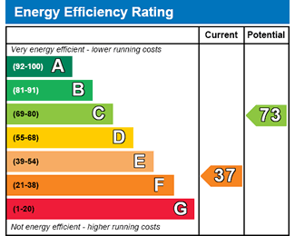

# Is your team energy efficient?

## Proposition

A means to assess your team's efficiency and present in a commonly understood format along with improvement recommendations.

This is not necessarily a replacement for all the things you might get from agile gurus, management consultants, KPI analysts and all sorts of other interventions; indeed you may well find the recommendations output from this is to get one in.

The point of this tool is to look at regular measures and tracking what a **great** high performing team really looks like, and rank the behaviours that build that up.

Examples of inefficient behaviour you might be accustomed to:

- Having to ask another team to do something you could probably do yourselves, and then having to chase when it's not done.
- Requiring a team lead/senior to approve work by hand
- Only a single person is describing the backlog of work to do
- Team members are often context switching and unable to reach [flow state](<https://en.wikipedia.org/wiki/Flow_(psychology)>)
- _...This list can and **will** be near infinite, we're effectively describing the forces working against a perfect closed system in [the 1st law of thermodynamics](https://en.wikipedia.org/wiki/Laws_of_thermodynamics#First_law) repurposed to talk about human team effort_

> "My team has so many niggles, what should I fix first?

... is a really hard to answer, as they stand those problems are totally unquantifiable to how much they're really effecting your efficiency, and what you should dedicate your attention to is subjective; and that is of course assuming that you have actually identified all the issues, we accept none of us are perfect - you might even find that you're part of the problem!

Hopefully using this will give you and your team space and time to reflect on how you work together and give you credible evidence where you need to justify a change to your management/customers/peers/suppliers in how you interact with them.

The current focus of this project is [agile software development](https://en.wikipedia.org/wiki/Agile_software_development) teams, though we strongly believe a lot of the heuristics of an efficient team are universal.

## How does it work?

As a member of a team, you'll sign up, and start answering some questions about your team, how you all work. As you do that we'll start providing a range of what your score might be based on what you tell us and immediately provide recommended interventions where necessary; the equivalent of saying _"turn off the heating in the summer"_ or _"insulate the loft"_.

Based on the answers of how you work, we'll look to provide integrations to your systems, such as email, ticketing systems for [backlogs](<https://en.wikipedia.org/wiki/Scrum_(software_development)#Product_backlog>), [CI](https://en.wikipedia.org/wiki/Continuous_integration), chat/IM, [version control](https://en.wikipedia.org/wiki/Version_control), documentation, etc etc.

We'll use those integrations to get a more accurate feel for how your team is working ([not that we don't trust you](https://en.wiktionary.org/wiki/to_err_is_human)).

## How do you score me?

This is a constantly evolving space, as an open source project we're really looking to the wider community of experts, consultants, gurus, thinkers, dreamers and potentially most importantly _(metaphorical)_ veterans with _(metaphorical)_ war wounds and stories to help us develop this.

### The process:

1. **Collect the anecdote**. This is the human long form story behind a positive change, a bad experience, an observation etc, but it has to **be real** not just theory; though we _**don't want to know names of people or companies**_. _We are looking into how you can provide these anonymously._ We do expect the author to 'own it' and answer questions about it raised by the community in order to:
1. **Identify/define the determining heuristics**. This may be linking to existing heuristics found in other anecdotes, and determining the weighting of each heuristic within that anecdote.
1. **Overall heuristic scoring** based on the above we model how we feel the heuristics effect the overall team efficiency.
1. **Collector build** we'll look to build an automated means of collecting the important metrics, at all points we'll look to avoid distracting your team and we promise not to suggest changes to how they work just so we can better measure them, that after all is not especially efficient! 😃

## But won't that mean my score is jumping about as you update the model?

No, we will develop this like software that you're used to, we'll publish fixed versions with a period of time they'll be maintained/supported by the community. So you'll elect to pin to `3.4.2` for example, which will mean the only way your score change is if your team behaviour does. We'll try to nudge you to update, and we'll aim for your previous scores to be re-evaluated by the new scoring model when you do.

## "I've got a great idea"

Amazing, we'd ♥️ to hear it! Please raise an issue in github, or come [talk to us on slack](https://join.slack.com/t/need-a-name-workspace/shared_invite/zt-f6s0bodx-_XDLTbZBGOMk4~TS5x7kTQ)
